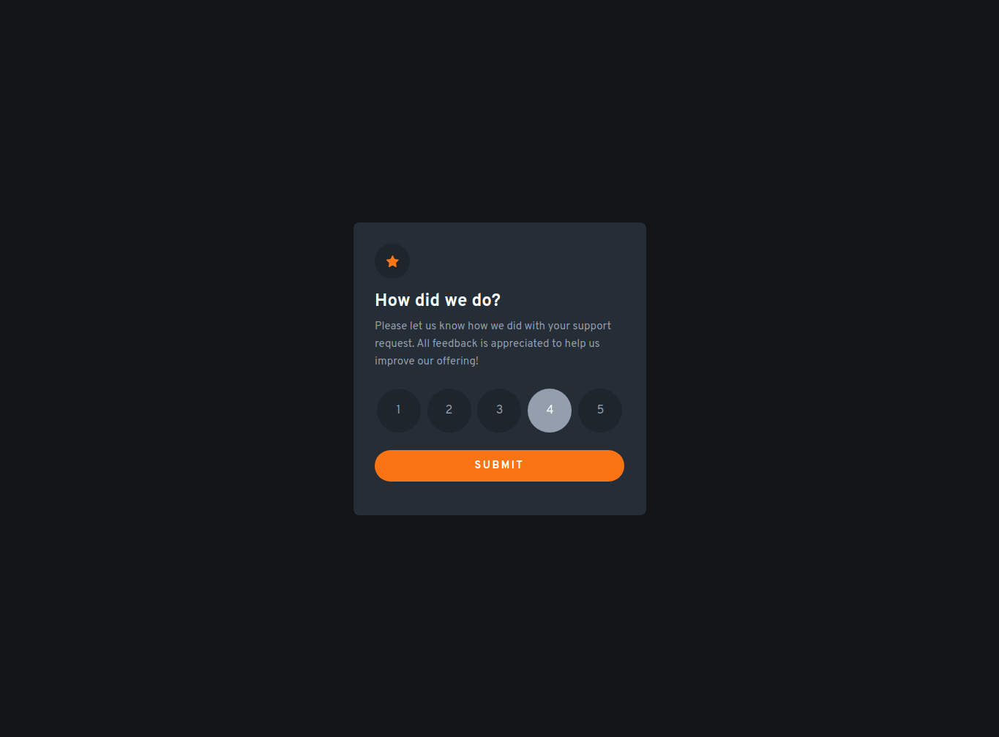
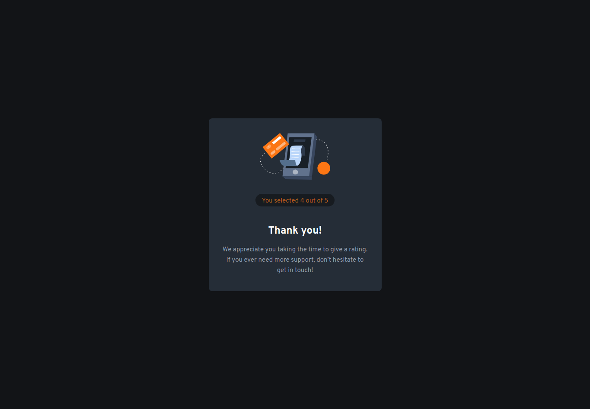

# Frontend Mentor - Interactive rating component solution

This is a solution to the [Interactive rating component challenge on Frontend Mentor](https://www.frontendmentor.io/challenges/interactive-rating-component-koxpeBUmI). Frontend Mentor challenges help you improve your coding skills by building realistic projects. 

## Table of contents

- [Overview](#overview)
  - [The challenge](#the-challenge)
  - [Screenshots](#screenshot)
  - [Links](#links)
- [My process](#my-process)
  - [Built with](#built-with)
  - [What I learned](#what-i-learned)

## Overview

### The challenge

Users should be able to:

- View the optimal layout for the app depending on their device's screen size
- See hover states for all interactive elements on the page
- Select and submit a number rating
- See the "Thank you" card state after submitting a rating

### Screenshots




### Links

- Solution URL: [https://github.com/ryangholland/interactive-rating-component]
- Live Site URL: [https://ryangholland.github.io/interactive-rating-component]

## My process

### Built with

- Semantic HTML5 markup
- CSS custom properties
- Mobile-first workflow
- Vanilla JS

### What I learned

I learned a few neat CSS tricks while building this project.

I used HTML radio buttons for the five rating choices, but hid them using CSS opacity and position properties. I added custom styling to the associated labels to allow users to interact with the page and make their choice.

I also learned how to take a custom HSL property and add opacity to it where needed. In this case, the rating choices were less opaque than the rest of the encompassing container's background.

```css
[type="radio"] {
  opacity: 0;
  position: absolute;
}

.rating-choices-container label {
  display: grid;
  place-items: center;
  min-width: 60px;
  border-radius: 50%;
  background-color: hsla(var(--clr-very-dark-blue-hsl), 0.3);
  color: var(--clr-light-grey);
  aspect-ratio: 1 / 1;
}

[type="radio"]:checked + label {
  background: var(--clr-pri-orange);
  color: var(--clr-neu-white);
  font-weight: bolder;
}
```


